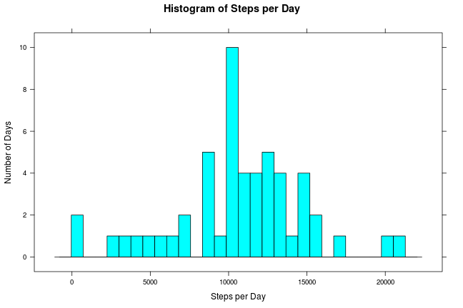
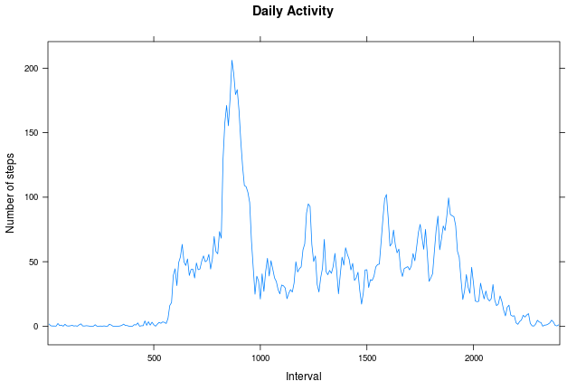
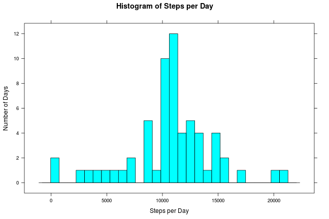
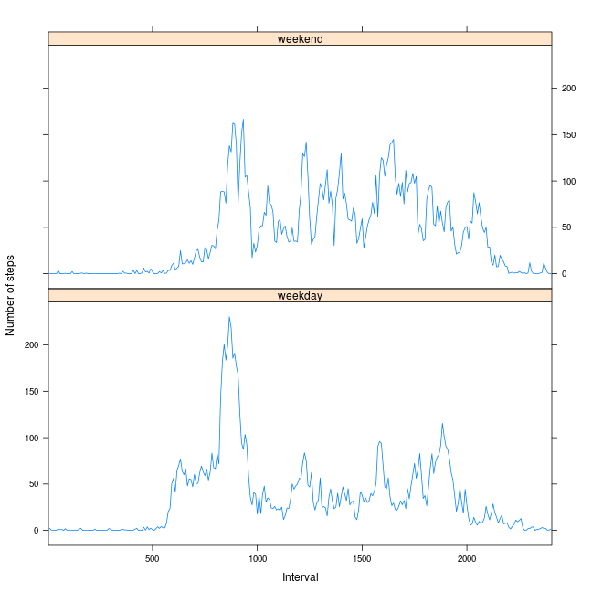

#Reproducible Research: Peer Asessment 1

## Introduction

```r
library(knitr)
# Set knitr options for the remainder of the document
opts_chunk$set(echo = TRUE, results = "asis")
```

## Loading and preprocessing the data

```r
colClasses = c('numeric', 'character','numeric')
activityDf <- read.csv('activity.csv', header = TRUE, colClasses = colClasses)
activityDf$interval <- as.factor(activityDf$interval)
```

## What is mean total number of steps taken per day?

```r
require(lattice)

dailysteps <- aggregate(steps ~ date, data=activityDf, sum)
histogram(dailysteps[[2]], type='count', 
          xlab='Steps per Day', ylab='Number of Days',
          main='Histogram of Steps per Day',
          nint=30 )
```

 

```r
meansteps <- mean(dailysteps[[2]])
print(meansteps)
```

[1] 10766.19

```r
mediansteps <- median(dailysteps[[2]])
print(mediansteps)
```

[1] 10765

## What is the average daily activity pattern?
Activity begins around 6:00 ramping up to a daytime high between 9:00 and 10:00.
Activity then fluctuates throughout the day, tapering off after 20:00.
The Peak activity of the day occurs at the 835 interval with an average of over
206 steps.

```r
require(lubridate)

activityDf$interval <- as.factor(activityDf$interval)
activityDf$dayofwk <- wday(activityDf$date, label=TRUE)

dailyactivityDf <- aggregate(steps ~ interval, data = activityDf, mean)

xyplot(steps ~ interval, data = dailyactivityDf, 
       type='l', 
       ylab='Number of steps', xlab='Interval',
       main='Daily Activity',
       scales = list(
		     x = list(at=seq(0, 288, by=60), labels=seq(0, 2400, by=500))
		     )
       )
```

 

```r
# Determine the average peak interval
peakinterval <- dailyactivityDf[max(dailyactivityDf[,"steps"])
                                ==dailyactivityDf$steps,
                                ]
print(peakinterval[,"interval"])
```

[1] 835
288 Levels: 0 5 10 15 20 25 30 35 40 45 50 55 100 105 110 115 120 ... 2355

```r
print(peakinterval[,"steps"])
```

[1] 206.1698

## Imputing missing values
Create a duplicate data frame and imput the average by the missing interval over
the other data points for each NA value in the original data frame.

```r
number_NAs <- sum(is.na(activityDf$steps))
print(number_NAs)
```

[1] 2304

```r
activityDf_noNAs <- activityDf

for (i in 1:nrow(activityDf_noNAs)) {
	if (is.na(activityDf_noNAs[i,"steps"])){
		specificinterval <- activityDf_noNAs[i,"interval"]
		avgs_by_int <- aggregate(steps~interval,data = dailyactivityDf,mean)
		avg <- avgs_by_int[avgs_by_int$interval == specificinterval,"steps"]
		activityDf_noNAs[i,"steps"] <- avg
	}
}

#show that updated data frame has 0 NAs
print(sum(is.na(activityDf_noNAs$steps)))
```

[1] 0

```r
# Same procedure as prior histogram
dailysteps_noNAs <- aggregate(steps ~ date, data=activityDf_noNAs, sum)
histogram(dailysteps_noNAs[[2]], type='count',
          xlab='Steps per Day', ylab='Number of Days',
          main='Histogram of Steps per Day', 
          nint=30)
```

 

```r
meansteps_noNAs<- mean(dailysteps_noNAs[[2]])
print(meansteps_noNAs)
```

[1] 10766.19

```r
mediansteps_noNAs <- median(dailysteps_noNAs[[2]])
print(mediansteps_noNAs)
```

[1] 10766.19

## Are there differences in activity patterns between weekdays and weekends?

The weekday activity ramps up quicker in the morning with a higher overall peak.
Then, after around 10:00, weekdays show lower activity.
Weekend actvity is mixed throughout the day with somewhat higher levels than
weekdays after the morning, and weekends have activity a little later at night.

```r
activityDf_noNAs$daytype <- ifelse(
  is.element(activityDf_noNAs$dayofwk,c('Sat','Sun')),
  'weekend',
  'weekday')
activity_bydaytype <- aggregate(steps ~ daytype + interval, 
                                data = activityDf_noNAs, 
                                mean)
names(activity_bydaytype) <- c("Day_Type","Interval","Avg_Steps")
xyplot(Avg_Steps ~ Interval| 
       Day_Type, 
       data = activity_bydaytype, 
       layout = c(1,2), 
       type='l', 
       ylab='Number of steps', 
       xlab='Interval',
       scales = list(
		     x = list(at=seq(0, 288, by=60), labels=seq(0, 2400, by=500))
		     )
       )
```

 
